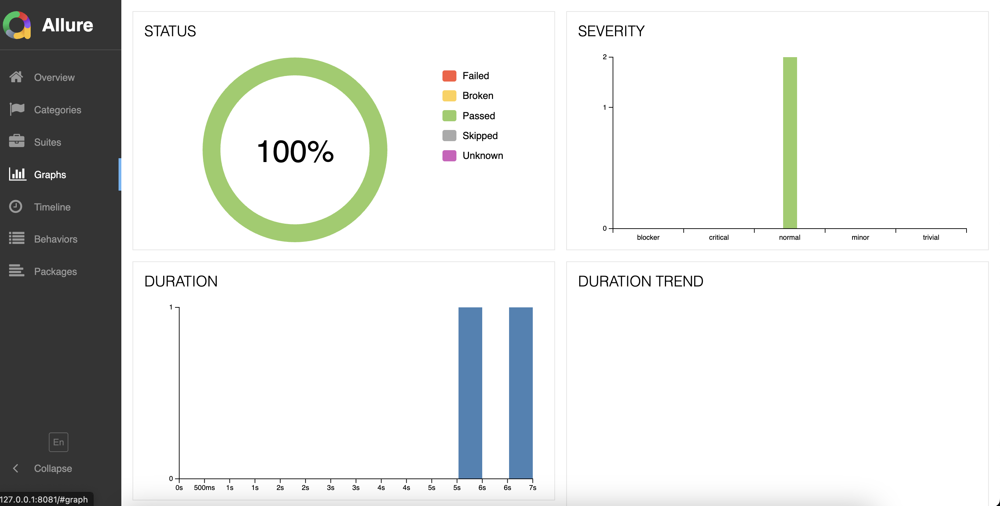
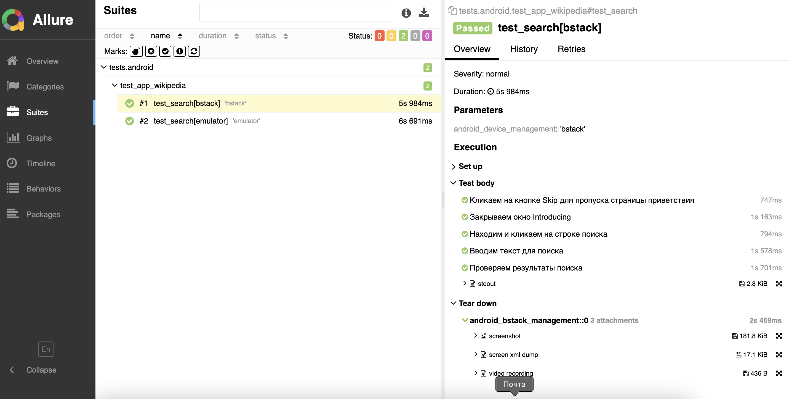
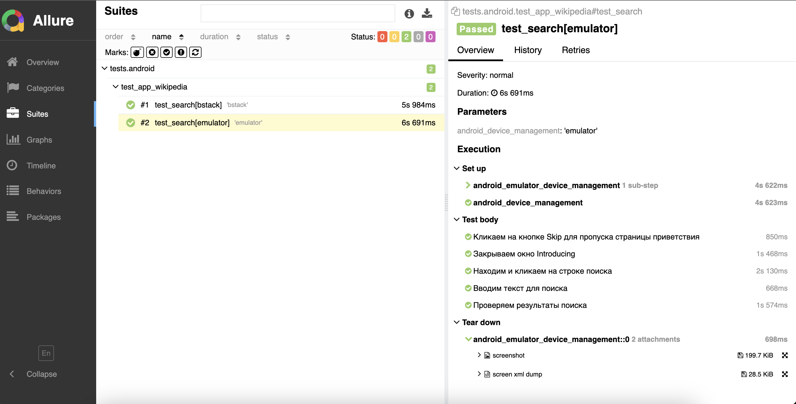
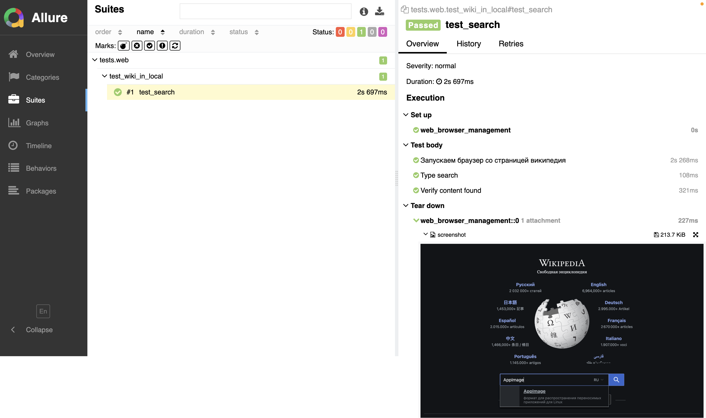

### Предварительные действия

1. __Для тестирования своего приложения на BrowserStack:__
    - с помощью команды ниже, на ресурс BrowserStack загружен файл приложения Wikipedia "app-alpha-universal-release.apk"

   ```
   curl -u "alexandersantalov_bsAqLc:N8yqKqzaEWS5DX9ibcJF"  -X POST "https://api-cloud.browserstack.com/app-automate/upload"  -F "file=@/path/to/app/file/application-debug.apk"
   ```
   >[Скачать 'app-alpha-universal-release.apk'](https://github.com/wikimedia/apps-android-wikipedia/releases/download/latest/app-alpha-universal-release.apk)
   
   >[Информация по загрузке файлов на BrowserStack](https://github.com/qa-guru/mobile-tests-13-py/tree/demo-selene-appium-with-browserstack-android#how-to-upload-your-own-version-of-application-to-browserstack)


2. __Для тестирования мобильных приложений на своём ПК установлены__:
    - Appium-server (_для связи с мобильными устройствами_)
    - Appium Inspector (_для инспекции элементов интерфейса мобильных приложений_)
    - Appium Driver UiAutomator2 (_для взаимодействия с android-системами_)
    - Android Studio (_для запуска эмулятора мобильного устройства_)


### Результаты тестов





